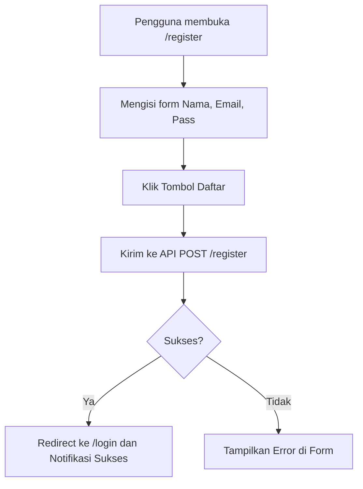
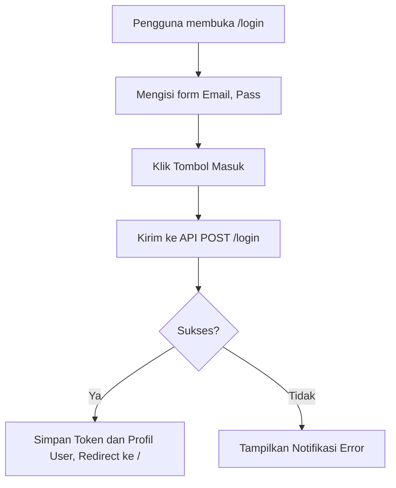
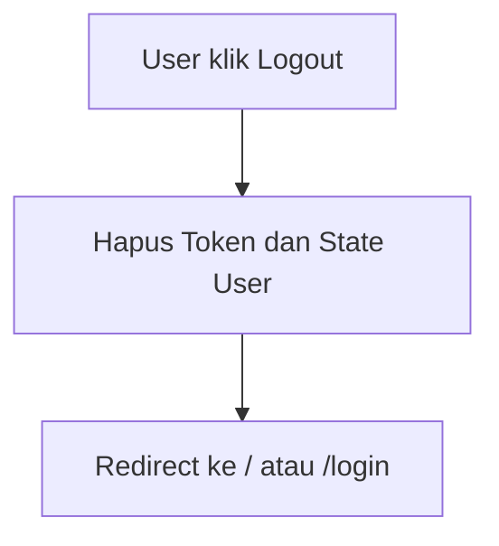

# Alur Kerja: Autentikasi Pengguna

Dokumen ini menjelaskan alur kerja (workflow) untuk semua proses yang terkait dengan autentikasi pengguna, yaitu pendaftaran, login, dan logout, dengan visualisasi diagram MermaidJS.

## 1. Alur Pendaftaran (Register)

**Aktor**: Pengguna Baru (Guest)
**Tujuan**: Membuat akun baru di aplikasi.

**Langkah-langkah:**

1.  **Aksi Pengguna**: Membuka halaman `/register` untuk melihat form pendaftaran.
2.  **Aksi Pengguna**: Mengisi data yang diperlukan (`Nama`, `Email`, `Password`).
3.  **Aksi Pengguna**: Menekan tombol "Daftar" untuk submit.
4.  **Sistem**: Mengirim data ke API. State loading ditampilkan.
5.  **Respon Sistem**:
    - **Sukses**: Mengarahkan pengguna ke halaman `/login`.
    - **Gagal**: Menampilkan pesan error di halaman registrasi.

## 2. Alur Login

**Aktor**: Pengguna Terdaftar
**Tujuan**: Masuk ke dalam aplikasi untuk mengakses fitur yang dilindungi.

**Langkah-langkah:**

1.  **Aksi Pengguna**: Membuka halaman `/login`.
2.  **Aksi Pengguna**: Mengisi `Email` dan `Password`.
3.  **Aksi Pengguna**: Menekan tombol "Masuk".
4.  **Sistem**: Mengirim kredensial ke API. State loading ditampilkan.
5.  **Respon Sistem**:
    - **Sukses**: Menyimpan token, mengisi state profil pengguna, dan mengarahkan ke halaman utama (`/`). UI di navbar diperbarui.
    - **Gagal**: Menampilkan pesan error "Email atau password salah".

## 3. Alur Logout

**Aktor**: Pengguna yang Sudah Login
**Tujuan**: Keluar dari aplikasi.

**Langkah-langkah:**

1.  **Aksi Pengguna**: Mengklik opsi "Logout" (biasanya dari menu profil di navbar).
2.  **Sistem**: Menghapus token dari local storage dan mereset state autentikasi di Redux.
3.  **Sistem**: Mengarahkan pengguna ke halaman utama atau halaman login.
