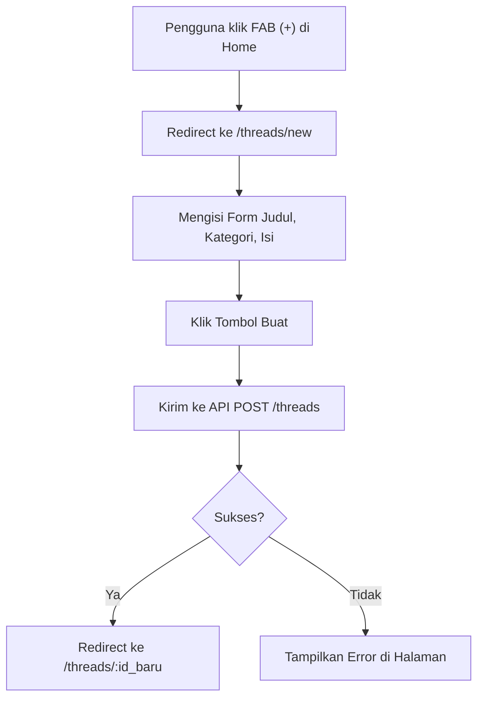

# Alur Kerja: Pembuatan Thread

Dokumen ini menjelaskan alur kerja (workflow) untuk proses pembuatan thread diskusi baru oleh pengguna yang sudah terautentikasi, dengan visualisasi diagram MermaidJS.

**Aktor**: Pengguna yang Sudah Login
**Tujuan**: Membuat dan mempublikasikan sebuah diskusi baru.

**Langkah-langkah:**

1.  **Pemicu**: Pengguna yang sudah login menekan tombol `(+)` di halaman utama.
2.  **Sistem**: Mengarahkan pengguna ke halaman `/threads/new` yang berisi form pembuatan thread.
3.  **Aksi Pengguna**: Mengisi `Judul`, `Kategori`, dan `Isi Diskusi`.
4.  **Aksi Pengguna**: Menekan tombol "Buat".
5.  **Sistem**: Mengirim data ke API `POST /threads` dan menampilkan state `loading`.
6.  **Respon Sistem**:
    - **Sukses**: Mengarahkan pengguna ke halaman detail dari thread yang baru dibuat (`/threads/:id_baru`).
    - **Gagal**: Menampilkan notifikasi error di halaman tersebut, memungkinkan pengguna memperbaiki inputnya.
