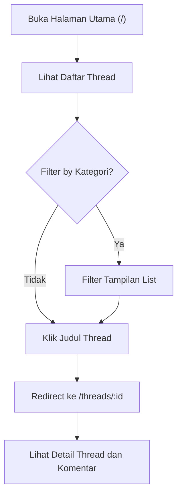
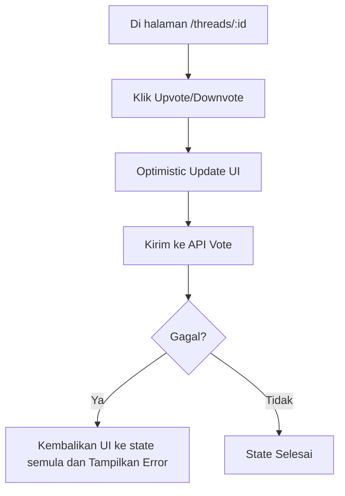
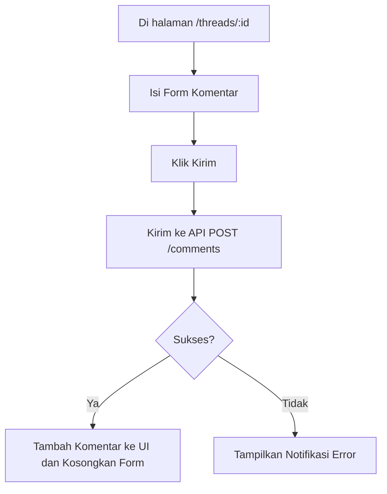

# Alur Kerja: Interaksi Thread

Dokumen ini menjelaskan alur kerja (workflow) umum pengguna saat berinteraksi dengan thread, dengan visualisasi diagram MermaidJS.

**Aktor**: Pengguna (Guest atau Login)
**Tujuan**: Membaca dan berpartisipasi dalam diskusi.

## 1. Melihat Daftar & Detail Thread

**Langkah-langkah:**

1.  **Aksi Pengguna**: Membuka halaman utama untuk melihat daftar thread.
2.  **Aksi Pengguna (Opsional)**: Memilih sebuah kategori untuk memfilter daftar thread.
3.  **Aksi Pengguna**: Mengklik judul thread yang menarik.
4.  **Sistem**: Mengarahkan ke halaman detail thread (`/threads/:id`) dan menampilkan konten lengkapnya.

## 2. Memberi Suara (Voting)

**Pra-kondisi**: Pengguna harus sudah login.

**Langkah-langkah:**

1.  **Aksi Pengguna**: Menekan tombol vote (up/down) pada thread atau komentar.
2.  **Sistem**: Merespon instan dengan mengubah tampilan UI vote (_Optimistic Update_).
3.  **Sistem**: Mengirim request vote ke API di background.
4.  **Respon Sistem**:
    - **Gagal**: Jika API gagal, tampilan UI dikembalikan seperti semula dan error ditampilkan.
    - **Sukses**: Tidak ada perubahan visual lebih lanjut. State data dikonfirmasi.

## 3. Menambah Komentar

**Pra-kondisi**: Pengguna harus sudah login.

**Langkah-langkah:**

1.  **Aksi Pengguna**: Mengisi form komentar di halaman detail thread.
2.  **Aksi Pengguna**: Menekan tombol "Kirim".
3.  **Sistem**: Mengirim data komentar ke API dan menampilkan state `loading`.
4.  **Respon Sistem**:
    - **Sukses**: Menambahkan komentar baru ke daftar, dan mengosongkan form input.
    - **Gagal**: Menampilkan notifikasi error.
